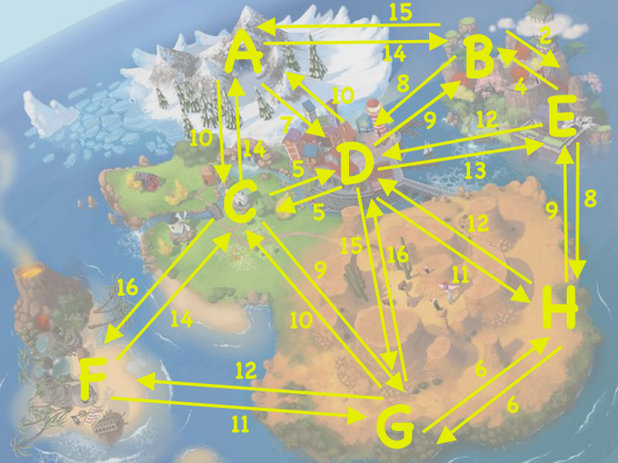

# Traveling Salesman
Create a cli tool that finds the shortest route for the traveling salesman to take!

 

## Backstory
Let's suppose this map represents the world you live in, and you are the traveling salesman. You begin at one city with all your inventory. Then you visit each city to sell your items and in the end you return home.

 

example visualization:

 

To go from any one city to another has a cost (think of it as the amount of gasoline used, or hours traveled, etc). The goal is to write a function that takes:

 

1) the city you need to begin and end with, and

 
 
2) this matrix of costs for traveling between cities.

 

## The Exercise

Part of the challenge here is determining how to represent the data in the visualization in terms of Rust data types.

The cli tool should accept two arguments: 

 
1) in the information about distances from one city to another, and

1) The starting/ending city.

The cli tool should output two things:

 
 1) the order of cities to in the most optimal path (or paths), and 
 
 
 2) the total travel cost of the entire path. Good luck! ⭐️

 

## Tests
Unit test the pure logic, number crunching functions here.

Once you find the optimal route, create an integration test that asserts the correct route and length is calculated!  

 

## Skills Practiced

- Working with weighted node/edge style graphs

- Deciding how to structure abstract data
  
 

## Bonus

- Provide also the "second best route"

- If there are multiple routes tied for the best, print all of them

- Provide a nice error message if given a starting/ending city that is not in the distance data
